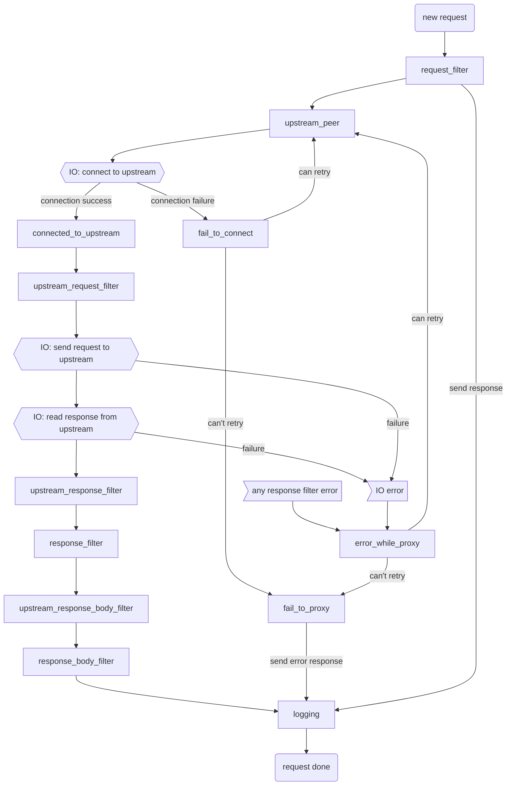

# Pingora 内部原理

(特别鸣谢[_James Munns_](https://github.com/jamesmunns)编写了这一部分的内容)

## `Server`的启动

Pingora 系统从孵化一个`Server`开始。`Server`负责启动已注册的所有`Service`并监听终止事件。

```
                               ┌───────────┐
                    ┌─────────>│  Service  │
                    │          └───────────┘
┌────────┐          │          ┌───────────┐
│ Server │──Spawns──┼─────────>│  Service  │
└────────┘          │          └───────────┘
                    │          ┌───────────┐
                    └─────────>│  Service  │
                               └───────────┘
```

当孵化完所有注册的`Service`，`Server`继续监听终止事件，终止事件会传播给已注册的所有`Service`。

## `Serivce`

在Pingora中包含两种服务:
- **监听服务(listening service)**，是用于监听指定的套接字并执行核心功能的实体。`Service`绑定了特定的端口和一组选项。
- **后台服务(background service)**，只执行一段任务，不监听套接字

我们在这一部分只讨论“监听服务”。

每个`Service`都有只属于自己的线程池/tokio运行时，他们蕴含的线程数基于所配置的值。
工作线程不会在`Service`之间共享。`Service`所用的运行时线程池可以基于**任务窃取**(tokio默认)，也可以基于**非任务窃取**(N个互相独立的单线程运行时)。

```
┌─────────────────────────┐
│ ┌─────────────────────┐ │
│ │┌─────────┬─────────┐│ │
│ ││  Conn   │  Conn   ││ │
│ │├─────────┼─────────┤│ │
│ ││Endpoint │Endpoint ││ │
│ │├─────────┴─────────┤│ │
│ ││     Listeners     ││ │
│ │├─────────┬─────────┤│ │
│ ││ Worker  │ Worker  ││ │
│ ││ Thread  │ Thread  ││ │
│ │├─────────┴─────────┤│ │
│ ││  Tokio Executor   ││ │
│ │└───────────────────┘│ │
│ └─────────────────────┘ │
│ ┌───────┐               │
└─┤Service├───────────────┘
  └───────┘
```

## 服务监听

在启动时，每个`Service`都被设置了一组监听端点。单个`Service`可以监听多个端点。`Server`也会传给它一些相关的配置，包括TLS设置。

这些端点会转换为监听套接字，称为`TransportStack`。每个`TransportStack`都被指派给了服务对应的执行器中的一个异步任务。

```
                                 ┌───────────────────┐
                                 │┌─────────────────┐│    ┌ ─ ─ ─ ─ ─ ─ ─ ─ ─ ─ ─ ┐  ┌ ─ ─ ─ ─ ─ ─ ─ ─ ─ ─ ─
 ┌─────────┐                     ││ TransportStack  ││                                ┌────────────────────┐│
┌┤Listeners├────────┐            ││                 ││    │                       │  ││                    │
│└─────────┘        │            ││ (Listener, TLS  │├──────spawn(run_endpoint())────>│ Service<ServerApp> ││
│┌─────────────────┐│            ││    Acceptor,    ││    │                       │  ││                    │
││    Endpoint     ││            ││   UpgradeFDs)   ││                                └────────────────────┘│
││   addr/ports    ││            │├─────────────────┤│    │                       │  │
││ + TLS Settings  ││            ││ TransportStack  ││                                ┌────────────────────┐│
│├─────────────────┤│            ││                 ││    │                       │  ││                    │
││    Endpoint     ││──build()─> ││ (Listener, TLS  │├──────spawn(run_endpoint())────>│ Service<ServerApp> ││
││   addr/ports    ││            ││    Acceptor,    ││    │                       │  ││                    │
││ + TLS Settings  ││            ││   UpgradeFDs)   ││                                └────────────────────┘│
│├─────────────────┤│            │├─────────────────┤│    │                       │  │
││    Endpoint     ││            ││ TransportStack  ││                                ┌────────────────────┐│
││   addr/ports    ││            ││                 ││    │                       │  ││                    │
││ + TLS Settings  ││            ││ (Listener, TLS  │├──────spawn(run_endpoint())────>│ Service<ServerApp> ││
│└─────────────────┘│            ││    Acceptor,    ││    │                       │  ││                    │
└───────────────────┘            ││   UpgradeFDs)   ││                                └────────────────────┘│
                                 │└─────────────────┘│    │ ┌───────────────┐     │  │ ┌──────────────┐
                                 └───────────────────┘     ─│start_service()│─ ─ ─    ─│ Worker Tasks ├ ─ ─ ┘
                                                            └───────────────┘          └──────────────┘
```

## 下游连接的生命周期

服务为每个入栈的连接启动一个任务。只要这些连接一直有新事件处理，就一直保持打开状态。

```
                                  ┌ ─ ─ ─ ─ ─ ─ ─ ─ ─ ─ ─ ─ ─ ─ ─ ─ ─ ─ ─ ─ ─ ─ ─ ─ ─ ─ ─ ─ ─ ─ ─ ─ ─ ─ ─ ─ ─ ─ ─ ─ ─ ┐

                                  │  ┌───────────────┐   ┌────────────────┐   ┌─────────────────┐    ┌─────────────┐  │
┌────────────────────┐               │ UninitStream  │   │    Service     │   │       App       │    │  Task Ends  │
│                    │            │  │ ::handshake() │──>│::handle_event()│──>│ ::process_new() │──┬>│             │  │
│ Service<ServerApp> │──spawn()──>   └───────────────┘   └────────────────┘   └─────────────────┘  │ └─────────────┘
│                    │            │                                                    ▲           │                  │
└────────────────────┘                                                                 │         while
                                  │                                                    └─────────reuse                │
                                     ┌───────────────────────────┐
                                  └ ─│  Task on Service Runtime  │─ ─ ─ ─ ─ ─ ─ ─ ─ ─ ─ ─ ─ ─ ─ ─ ─ ─ ─ ─ ─ ─ ─ ─ ─ ─ ┘
                                     └───────────────────────────┘
```

## 代理释义

有趣的是，`pingora` `Server`本身并没有针对**代理**的特定概念。

取而代之，它从`Service`这个角度切入，内含一个`ServiceApp`特质的实现者。

例如，下图演示了来自于`pingora-proxy`包的`HttpProxy`结构体，是如何变成由`Server`孵化的`Service`的：

```
┌─────────────┐
│  HttpProxy  │
│  (struct)   │
└─────────────┘
       │
   implements   ┌─────────────┐
       │        │HttpServerApp│
       └───────>│   (trait)   │
                └─────────────┘
                       │
                   implements   ┌─────────────┐
                       │        │  ServerApp  │
                       └───────>│   (trait)   │
                                └─────────────┘
                                       │
                                   contained    ┌─────────────────────┐
                                     within     │                     │
                                       └───────>│ Service<ServiceApp> │
                                                │                     │
                                                └─────────────────────┘
```

下图演示了，在不同的层级提供的功能和辅助设施。

```
┌─────────────┐        ┌──────────────────────────────────────┐
│  HttpProxy  │        │Handles high level Proxying workflow, │
│  (struct)   │─ ─ ─ ─ │   customizable via ProxyHttp trait   │
└──────┬──────┘        └──────────────────────────────────────┘
       │
┌──────▼──────┐        ┌──────────────────────────────────────┐
│HttpServerApp│        │ Handles selection of H1 vs H2 stream │
│   (trait)   │─ ─ ─ ─ │     handling, incl H2 handshake      │
└──────┬──────┘        └──────────────────────────────────────┘
       │
┌──────▼──────┐        ┌──────────────────────────────────────┐
│  ServerApp  │        │ Handles dispatching of App instances │
│   (trait)   │─ ─ ─ ─ │   as individual tasks, per Session   │
└──────┬──────┘        └──────────────────────────────────────┘
       │
┌──────▼──────┐        ┌──────────────────────────────────────┐
│ Service<A>  │        │ Handles dispatching of App instances │
│  (struct)   │─ ─ ─ ─ │  as individual tasks, per Listener   │
└─────────────┘        └──────────────────────────────────────┘
```

`HttpProxy`结构体处理代理HTTP连接时的高层工作流。

内部使用了`ProxyHttp`(注意单词顺序是反过来的)**特质**的实例，可以让用户在下面的每个步骤中插入自定义的逻辑(图来自[阶段图](./phase_chart.md)):



## 俯瞰代理

在讲解细节之前，先俯瞰下一个代理是如何工作的：

```
┌────────────┐          ┌─────────────┐         ┌────────────┐
│ Downstream │          │    Proxy    │         │  Upstream  │
│   Client   │─────────>│             │────────>│   Server   │
└────────────┘          └─────────────┘         └────────────┘
```

代理先与**下游**建立连接，再连接到一个选择的**上游**。被选择到的上游称为`Peer`。

一旦连接建立完成，下游和上游就可以进行双向通信了。

至此，对于`Server`、`Service`、`Listeners`的讨论都集中在图中的左半边：处理下游的入栈连接，然后传给代理组件。

下一步，我们将关注此图的右边一半：连接到上游。

## 管理上游

通过`Connector`连接到上游`Peer`。`Connector`不是指某个特定的类型或特质，更多的是一种“模式”。

连接器负责以下工作：
* 与`Peer`建立连接
* 维护此`Peer`对应的连接池，实现连接复用:
    * 来自同一个下游客户端的多个请求
    * 来自不同的下游客户端的多个请求
* 评估连接的健康状态, 对于H2连接会定期执行ping操作。
* 处理具有多个池化层的协议，如H2
* 缓存，如果与协议相关并且已开启
* 压缩，如果与协议相关并且已开启

在下图中，可以看到代理的各端是如何处理的：

```
┌────────────┐          ┌─────────────┐         ┌────────────┐
│ Downstream │       ┌ ─│─   Proxy  ┌ ┼ ─       │  Upstream  │
│   Client   │─────────>│ │           │──┼─────>│   Server   │
└────────────┘       │  └───────────┼─┘         └────────────┘
                      ─ ─ ┘          ─ ─ ┘
                        ▲              ▲
                     ┌──┘              └──┐
                     │                    │
                ┌ ─ ─ ─ ─ ┐         ┌ ─ ─ ─ ─ ─
                 Listeners           Connectors│
                └ ─ ─ ─ ─ ┘         └ ─ ─ ─ ─ ─
```

## Connectors如何对应多个Peer

`Connectors`只能处理到单个`Peer`的连接，要想实现从多个`Peer`中选择一个`Peer`需要在上层进行处理，
即在`ProxyHttp`特质的`upstream_peer()`方法中。
