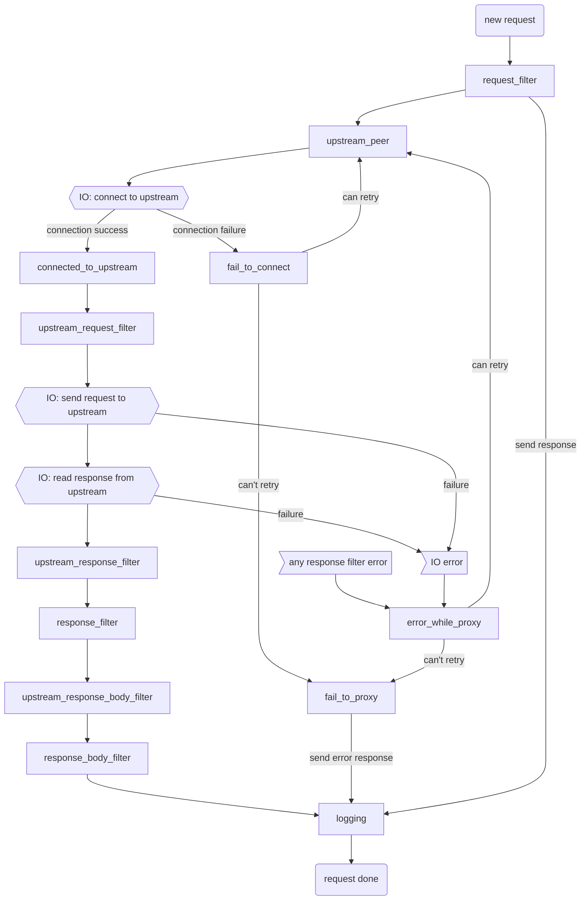

# 请求处理过程: 各阶段和过滤器

## 介绍
Pingora HTTP 代理框架支持可编程的代理行为。允许开发人员将自定义的逻辑注入到处理请求过程中的各个阶段。

## 代理HTTP请求的处理过程
1. 首先，从**下游**(客户端)读取请求头。
2. 然后，连接到**上游**(远程服务器)。如果连接是[复用的已有连接](pooling.md)则跳过这一步。
3. 然后，向上游发送请求头。
4. 给上游的请求头发送完毕后，代理进入双向模式，同时代理:
    a. 上游的响应(头和正文)给下游
    b. 下游的正文给上游(如果有)
5. 总的请求/响应完成后，请求过程就结束了，会释放请求相关的资源。下游连接和上游连接在适当的情况下会被复用。

## Pringora各阶段和过滤器
开发人员可以在 Pingora 代理处理请求的过程中插入任意的逻辑。

### 常规过滤器使用指南
* 大多数过滤器返回[`pingora_error::Result<_>`](errors.md)。当返回值为`Result::Err`时会调用`fail_to_proxy()`，请求被终止。
* 大多数过滤器都是异步函数，允许在过滤器中执行其它异步函数操作，如IO操作。
* 每个请求都对应一个自己的`CTX`对象，可用来在同一个请求的各个过滤器中共享状态。所有过滤器都以可变的方式访问此对象。
* 大多数过滤器都是可选的.
* 之所以既有`upstream_response_*_filter()`又有`response_*_filter()`，是为了与HTTP缓存集成(进行中...)。

### `request_filter()`
这个阶段是每个请求的首个阶段。

常用于验证请求内容、限速、初始化上下文。

### `proxy_upstream_filter()`
这个阶段决定我们是否应当继续向上游发起请求。如果熔断了，则默认返回502，也可以自定义实现不同的响应内容。

此阶段返回一个布尔值，决定我们是否应当继续向上游发起请求，还是直接返回错误。

### `upstream_peer()`
这个阶段决定应当连接哪一个上游(例如利用DNS查询和哈希/轮询)，以及如何连接上游。

此阶段返回`Peer`，定义了需要连接的上游。此阶段是**必选**的，不能忽略。

### `connected_to_upstream()`
这个阶段会在和上游建立连接后执行。

这个阶段通常用于记录日志。此阶段会报告 RTT 和上游的 TLS ciphers 等连接信息。

### `fail_to_connect()`
这个阶段是与`connected_to_upstream()`互斥的阶段。如果连接到上游时遇到了错误，则触发此阶段。

在本阶段，用户可以将错误报告给 Sentry/Prometheus/error_log。用户也可以决定错误是否是可重试的。
- 如果错误是可重试的，会再次调用`upstream_peer()`，用户可以抉择是否重试同一个上游或者转移到另一个上游。
- 如果错误是不可重试的，请求终止。

### `upstream_request_filter()`
这个阶段用于向上游发起请求前修改请求内容。

### `upstream_response_filter()`/`upstream_response_body_filter()`
当代理接收完上游的**头部/正文**后触发此阶段

此阶段用与在响应的**头部/正文**发送给下游之前做一些修改。注意此阶段**先于**HTTP缓存执行，因此在这个阶段所做的修改也会影响到缓存的内容。

### `response_filter()`/`response_body_filter()`/`response_trailer_filter()`
这个阶段在响应的**头部/正文/尾部**准备发送给下游之前触发。

此阶段用于在发送给下游之前对他们做一些修改。

### `error_while_proxy()`
如果请求代理到上游期间(发送请求/读取响应)报错了，则会触发此阶段，此阶段发生于连接建立以后。

在连接是复用的且HTTP方法是幂等的情况下，这个阶段可以决定是否**重试**请求。

### `fail_to_proxy()`
无论在上面的各阶段是否遇到了错误，此阶段总是会触发。

此阶段常用于记录错误日志、错误报告给下游。

### `logging()`
这是最后一个阶段，在请求完成处理完成之后(或报错之后)、资源释放之前执行。
每个请求都会在这个阶段终结。

此阶段常用于记录日志和本次请求最后的清理工作。

### `request_summary()`
这是一个普通的用户回调函数，不是一个请求处理阶段。

每个抵达`fail_to_proxy()`的错误都会自动记录到错误日志中。记录错误日志时会调用`request_summary()`导出与本次请求相关的信息。

本回调函数返回一个字符串，用户可以自定义向错误日志中导出的信息内容，用来对失败的请求进行跟踪和调试。

### `suppress_error_log()`
这是一个普通的用户回调函数，不是一个请求处理阶段。

`fail_to_proxy()`错误会自动记录到错误日志中，但是用户不一定想关注所有错误。
例如，在客户端提前断开连接时会记录下游的错误日志，但是如果用户只关心上游的情况，则下游的日志会对用户造成干扰。
这个回调函数可以对错误进行侦测并返回true或false。如果返回true，则错误内容不会被写入错入日志。

### Cache filters

To be documented
